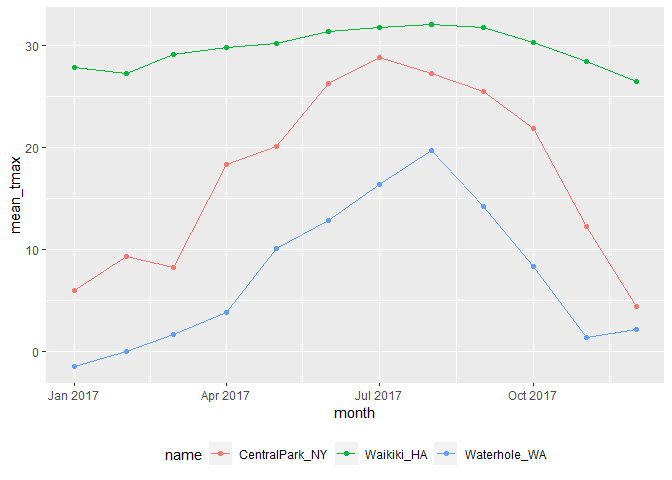
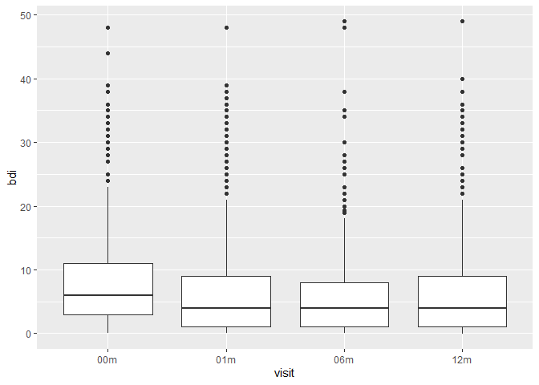
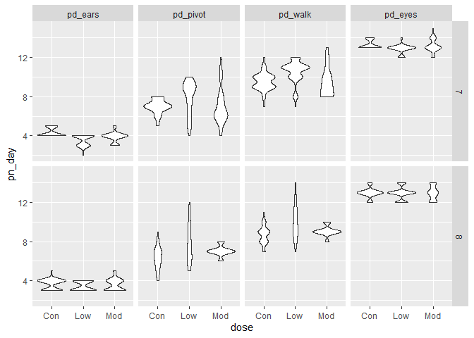

group by and summarize
================

``` r
library(tidyverse)
```

    ## -- Attaching packages --------------------------------------- tidyverse 1.3.1 --

    ## v ggplot2 3.3.5     v purrr   0.3.4
    ## v tibble  3.1.5     v dplyr   1.0.7
    ## v tidyr   1.1.4     v stringr 1.4.0
    ## v readr   2.0.2     v forcats 0.5.1

    ## -- Conflicts ------------------------------------------ tidyverse_conflicts() --
    ## x dplyr::filter() masks stats::filter()
    ## x dplyr::lag()    masks stats::lag()

Loading dataset

``` r
weather_df =  
  rnoaa::meteo_pull_monitors(
    c("USW00094728", "USC00519397", "USS0023B17S"),
    var = c("PRCP", "TMIN", "TMAX"), 
    date_min = "2017-01-01",
    date_max = "2017-12-31") %>%
  mutate(
    name = recode(
      id, 
      USW00094728 = "CentralPark_NY", 
      USC00519397 = "Waikiki_HA",
      USS0023B17S = "Waterhole_WA"),
    tmin = tmin / 10,
    tmax = tmax / 10,
    month = lubridate::floor_date(date, unit = "month")) %>%
  select(name, id, everything())
```

    ## Registered S3 method overwritten by 'hoardr':
    ##   method           from
    ##   print.cache_info httr

    ## using cached file: C:\Users\Budd\AppData\Local/Cache/R/noaa_ghcnd/USW00094728.dly

    ## date created (size, mb): 2021-10-05 10:29:55 (7.617)

    ## file min/max dates: 1869-01-01 / 2021-10-31

    ## using cached file: C:\Users\Budd\AppData\Local/Cache/R/noaa_ghcnd/USC00519397.dly

    ## date created (size, mb): 2021-10-05 10:30:05 (1.701)

    ## file min/max dates: 1965-01-01 / 2020-02-29

    ## using cached file: C:\Users\Budd\AppData\Local/Cache/R/noaa_ghcnd/USS0023B17S.dly

    ## date created (size, mb): 2021-10-05 10:30:10 (0.913)

    ## file min/max dates: 1999-09-01 / 2021-09-30

## `group_by`

``` r
weather_df %>%
  group_by(name, month)
```

    ## # A tibble: 1,095 x 7
    ## # Groups:   name, month [36]
    ##    name           id          date        prcp  tmax  tmin month     
    ##    <chr>          <chr>       <date>     <dbl> <dbl> <dbl> <date>    
    ##  1 CentralPark_NY USW00094728 2017-01-01     0   8.9   4.4 2017-01-01
    ##  2 CentralPark_NY USW00094728 2017-01-02    53   5     2.8 2017-01-01
    ##  3 CentralPark_NY USW00094728 2017-01-03   147   6.1   3.9 2017-01-01
    ##  4 CentralPark_NY USW00094728 2017-01-04     0  11.1   1.1 2017-01-01
    ##  5 CentralPark_NY USW00094728 2017-01-05     0   1.1  -2.7 2017-01-01
    ##  6 CentralPark_NY USW00094728 2017-01-06    13   0.6  -3.8 2017-01-01
    ##  7 CentralPark_NY USW00094728 2017-01-07    81  -3.2  -6.6 2017-01-01
    ##  8 CentralPark_NY USW00094728 2017-01-08     0  -3.8  -8.8 2017-01-01
    ##  9 CentralPark_NY USW00094728 2017-01-09     0  -4.9  -9.9 2017-01-01
    ## 10 CentralPark_NY USW00094728 2017-01-10     0   7.8  -6   2017-01-01
    ## # ... with 1,085 more rows

## count some things

``` r
# tidy for analysis
weather_df %>%
  group_by(month, name) %>%
  summarise(n_obs = n())
```

    ## `summarise()` has grouped output by 'month'. You can override using the `.groups` argument.

    ## # A tibble: 36 x 3
    ## # Groups:   month [12]
    ##    month      name           n_obs
    ##    <date>     <chr>          <int>
    ##  1 2017-01-01 CentralPark_NY    31
    ##  2 2017-01-01 Waikiki_HA        31
    ##  3 2017-01-01 Waterhole_WA      31
    ##  4 2017-02-01 CentralPark_NY    28
    ##  5 2017-02-01 Waikiki_HA        28
    ##  6 2017-02-01 Waterhole_WA      28
    ##  7 2017-03-01 CentralPark_NY    31
    ##  8 2017-03-01 Waikiki_HA        31
    ##  9 2017-03-01 Waterhole_WA      31
    ## 10 2017-04-01 CentralPark_NY    30
    ## # ... with 26 more rows

``` r
weather_df %>%
  count(name)
```

    ## # A tibble: 3 x 2
    ##   name               n
    ##   <chr>          <int>
    ## 1 CentralPark_NY   365
    ## 2 Waikiki_HA       365
    ## 3 Waterhole_WA     365

data frame don’t use `table`

``` r
weather_df %>%
  janitor::tabyl(month, name)
```

    ##       month CentralPark_NY Waikiki_HA Waterhole_WA
    ##  2017-01-01             31         31           31
    ##  2017-02-01             28         28           28
    ##  2017-03-01             31         31           31
    ##  2017-04-01             30         30           30
    ##  2017-05-01             31         31           31
    ##  2017-06-01             30         30           30
    ##  2017-07-01             31         31           31
    ##  2017-08-01             31         31           31
    ##  2017-09-01             30         30           30
    ##  2017-10-01             31         31           31
    ##  2017-11-01             30         30           30
    ##  2017-12-01             31         31           31

``` r
# better than `table` wider not tidy for read.
```

## more genral summaries

``` r
weather_df %>%
  group_by( name, month) %>%
  summarise(
    n_obs = n(),
    mean_tmax = mean(tmax,na.rm = TRUE),
    median_tmax = median(tmax,na.rm = TRUE) ,
    sd_tmax = sd(tmax,na.rm = TRUE) ) %>%
    ggplot(aes(x = month, y = mean_tmax, color = name)) + 
    geom_point() + geom_line() + 
    theme(legend.position = "bottom")
```

    ## `summarise()` has grouped output by 'name'. You can override using the `.groups` argument.

<!-- --> formatting table
outputs

``` r
weather_df %>%
  group_by( name, month) %>%
  summarise(
    n_obs = n(),
    mean_tmax = mean(tmax,na.rm = TRUE)) %>%
  knitr::kable(digits = 2)
```

    ## `summarise()` has grouped output by 'name'. You can override using the `.groups` argument.

| name            | month      | n\_obs | mean\_tmax |
|:----------------|:-----------|-------:|-----------:|
| CentralPark\_NY | 2017-01-01 |     31 |       5.98 |
| CentralPark\_NY | 2017-02-01 |     28 |       9.28 |
| CentralPark\_NY | 2017-03-01 |     31 |       8.22 |
| CentralPark\_NY | 2017-04-01 |     30 |      18.27 |
| CentralPark\_NY | 2017-05-01 |     31 |      20.09 |
| CentralPark\_NY | 2017-06-01 |     30 |      26.26 |
| CentralPark\_NY | 2017-07-01 |     31 |      28.74 |
| CentralPark\_NY | 2017-08-01 |     31 |      27.19 |
| CentralPark\_NY | 2017-09-01 |     30 |      25.43 |
| CentralPark\_NY | 2017-10-01 |     31 |      21.79 |
| CentralPark\_NY | 2017-11-01 |     30 |      12.29 |
| CentralPark\_NY | 2017-12-01 |     31 |       4.47 |
| Waikiki\_HA     | 2017-01-01 |     31 |      27.76 |
| Waikiki\_HA     | 2017-02-01 |     28 |      27.22 |
| Waikiki\_HA     | 2017-03-01 |     31 |      29.08 |
| Waikiki\_HA     | 2017-04-01 |     30 |      29.71 |
| Waikiki\_HA     | 2017-05-01 |     31 |      30.11 |
| Waikiki\_HA     | 2017-06-01 |     30 |      31.31 |
| Waikiki\_HA     | 2017-07-01 |     31 |      31.76 |
| Waikiki\_HA     | 2017-08-01 |     31 |      32.02 |
| Waikiki\_HA     | 2017-09-01 |     30 |      31.74 |
| Waikiki\_HA     | 2017-10-01 |     31 |      30.29 |
| Waikiki\_HA     | 2017-11-01 |     30 |      28.38 |
| Waikiki\_HA     | 2017-12-01 |     31 |      26.46 |
| Waterhole\_WA   | 2017-01-01 |     31 |      -1.40 |
| Waterhole\_WA   | 2017-02-01 |     28 |      -0.02 |
| Waterhole\_WA   | 2017-03-01 |     31 |       1.67 |
| Waterhole\_WA   | 2017-04-01 |     30 |       3.87 |
| Waterhole\_WA   | 2017-05-01 |     31 |      10.10 |
| Waterhole\_WA   | 2017-06-01 |     30 |      12.87 |
| Waterhole\_WA   | 2017-07-01 |     31 |      16.33 |
| Waterhole\_WA   | 2017-08-01 |     31 |      19.65 |
| Waterhole\_WA   | 2017-09-01 |     30 |      14.16 |
| Waterhole\_WA   | 2017-10-01 |     31 |       8.31 |
| Waterhole\_WA   | 2017-11-01 |     30 |       1.38 |
| Waterhole\_WA   | 2017-12-01 |     31 |       2.21 |

What about tmax and tmin

``` r
pulse_df = 
  haven::read_sas("./data/public_pulse_data.sas7bdat") %>%
  janitor::clean_names() %>%
  pivot_longer(
    bdi_score_bl:bdi_score_12m,
    names_to = "visit", 
    names_prefix = "bdi_score_",
    values_to = "bdi") %>%
  select(id, visit, everything()) %>%
  mutate(
    visit = recode(visit, "bl" = "00m"),
    visit = factor(visit, levels = str_c(c("00", "01", "06", "12"), "m"))) %>%
  arrange(id, visit)

pulse_df %>%
  ggplot(aes(x = visit, y = bdi)) +
  geom_boxplot()
```

    ## Warning: Removed 879 rows containing non-finite values (stat_boxplot).

<!-- -->

``` r
pup_data = 
  read_csv("./data/FAS_pups.csv", col_types = "ciiiii") %>%
  janitor::clean_names() %>%
  mutate(sex = recode(sex, `1` = "male", `2` = "female")) 

litter_data = 
  read_csv("./data/FAS_litters.csv", col_types = "ccddiiii") %>%
  janitor::clean_names() %>%
  separate(group, into = c("dose", "day_of_tx"), sep = 3)

fas_data = left_join(pup_data, litter_data, by = "litter_number") 

fas_data %>% 
  select(sex, dose, day_of_tx, pd_ears:pd_walk) %>% 
  pivot_longer(
    pd_ears:pd_walk,
    names_to = "outcome", 
    values_to = "pn_day") %>% 
  drop_na() %>% 
  mutate(outcome = forcats::fct_reorder(outcome, pn_day, median)) %>% 
  ggplot(aes(x = dose, y = pn_day)) + 
  geom_violin() + 
  facet_grid(day_of_tx ~ outcome)
```

<!-- -->
