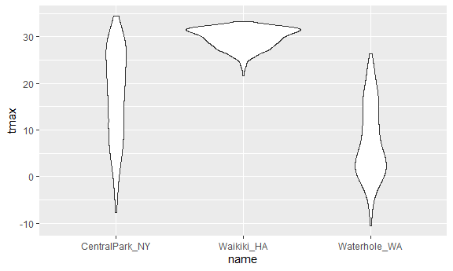
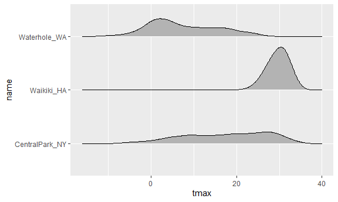
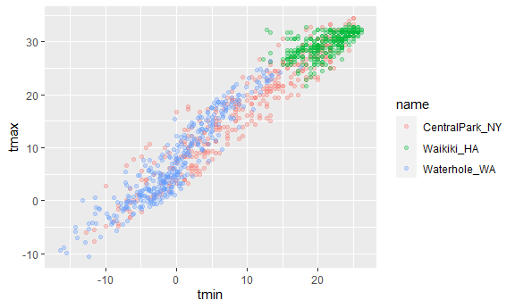
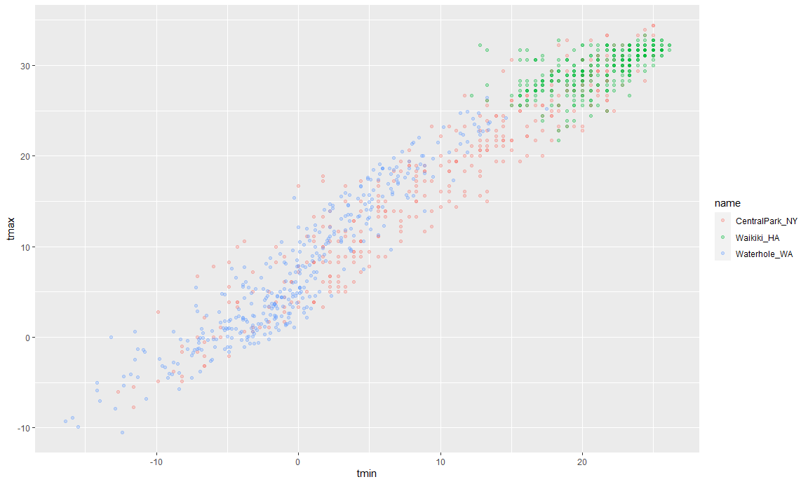
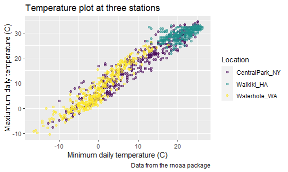
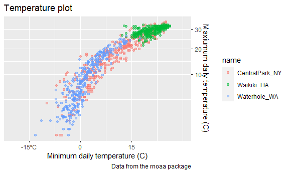
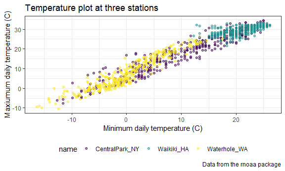
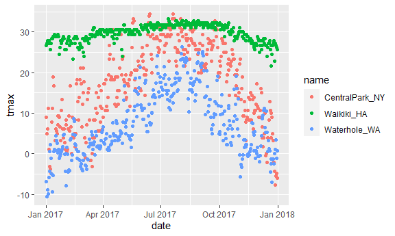
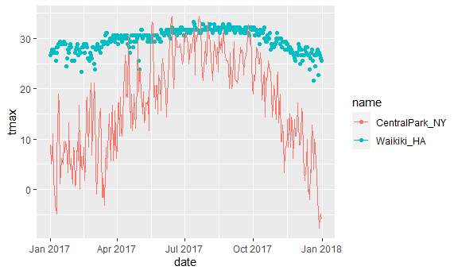

ggplot 1
================

``` r
library(tidyverse)
```

    ## -- Attaching packages --------------------------------------- tidyverse 1.3.1 --

    ## v ggplot2 3.3.5     v purrr   0.3.4
    ## v tibble  3.1.5     v dplyr   1.0.7
    ## v tidyr   1.1.4     v stringr 1.4.0
    ## v readr   2.0.2     v forcats 0.5.1

    ## -- Conflicts ------------------------------------------ tidyverse_conflicts() --
    ## x dplyr::filter() masks stats::filter()
    ## x dplyr::lag()    masks stats::lag()

``` r
library(ggridges)
library(viridis)
```

    ## Loading required package: viridisLite

``` r
knitr::opts_chunk$set(  #global setting of chunk
  fig.width = 6,
  fig.asp = .6,
  out.width = "90%"
)
```

Loading dataset

``` r
weather_df = 
  rnoaa::meteo_pull_monitors(
    c("USW00094728", "USC00519397", "USS0023B17S"),
    var = c("PRCP", "TMIN", "TMAX"), 
    date_min = "2017-01-01",
    date_max = "2017-12-31") %>%
  mutate(
    name = recode(
      id, 
      USW00094728 = "CentralPark_NY", 
      USC00519397 = "Waikiki_HA",
      USS0023B17S = "Waterhole_WA"),
    tmin = tmin / 10,
    tmax = tmax / 10) %>%
  select(name, id, everything())
```

    ## Registered S3 method overwritten by 'hoardr':
    ##   method           from
    ##   print.cache_info httr

    ## using cached file: C:\Users\Budd\AppData\Local/Cache/R/noaa_ghcnd/USW00094728.dly

    ## date created (size, mb): 2021-10-05 10:29:55 (7.617)

    ## file min/max dates: 1869-01-01 / 2021-10-31

    ## using cached file: C:\Users\Budd\AppData\Local/Cache/R/noaa_ghcnd/USC00519397.dly

    ## date created (size, mb): 2021-10-05 10:30:05 (1.701)

    ## file min/max dates: 1965-01-01 / 2020-02-29

    ## using cached file: C:\Users\Budd\AppData\Local/Cache/R/noaa_ghcnd/USS0023B17S.dly

    ## date created (size, mb): 2021-10-05 10:30:10 (0.913)

    ## file min/max dates: 1999-09-01 / 2021-09-30

## Scatterplot

``` r
ggp_tmax_tmin =
  weather_df %>%
  ggplot(aes(x = tmin, y = tmax)) +
  geom_point()
```

## Let’s fancy it up

color, lines, and so on

``` r
weather_df %>%
  ggplot(aes(x = tmin, y = tmax, color = name)) + #global setting for color
  geom_point(alpha = .3) + # local setting for color
  geom_smooth(se = FALSE) + # smooth line to approach data
  facet_grid(. ~ name) # separate the graphs.
```

    ## `geom_smooth()` using method = 'loess' and formula 'y ~ x'

    ## Warning: Removed 15 rows containing non-finite values (stat_smooth).

    ## Warning: Removed 15 rows containing missing values (geom_point).


one more scatt

``` r
weather_df %>%
  ggplot(aes(x = date, y = tmax, size = prcp)) +
  geom_point(alpha = .3) + # local setting for color
  geom_smooth(se = FALSE) + # smooth line to approach data
  facet_grid(. ~ name) # separate the graphs.  
```

    ## `geom_smooth()` using method = 'loess' and formula 'y ~ x'

    ## Warning: Removed 3 rows containing non-finite values (stat_smooth).

    ## Warning: Removed 3 rows containing missing values (geom_point).


## with manipulation

``` r
#weather_df %>%
#  filter(name == "CentralPark_NY") %>%
#  mutate(tmax = tmax *(9/5)+32)
```

## Stacking geoms

``` r
weather_df %>%
  ggplot(aes(x = date, y = tmax, color = name)) +
  geom_smooth(se = FALSE) 
```

    ## `geom_smooth()` using method = 'loess' and formula 'y ~ x'

    ## Warning: Removed 3 rows containing non-finite values (stat_smooth).


``` r
weather_df %>%
  ggplot(aes(x = tmax, y = tmin)) +
  geom_hex()
```

    ## Warning: Removed 15 rows containing non-finite values (stat_binhex).


``` r
# geom_bin_2d()
```

## Univariate plots

``` r
weather_df %>%
  ggplot( aes(x = tmax, fill = name)) + 
  geom_histogram() +
  facet_grid(. ~ name)
```

    ## `stat_bin()` using `bins = 30`. Pick better value with `binwidth`.

    ## Warning: Removed 3 rows containing non-finite values (stat_bin).


Try other plots

``` r
weather_df %>%
  ggplot(aes(x = tmax, fill = name)) +
  geom_density(alpha = .3)
```

    ## Warning: Removed 3 rows containing non-finite values (stat_density).


box plot

``` r
weather_df %>%
  ggplot( aes(x = name, y = tmax)) + 
  geom_boxplot()
```

    ## Warning: Removed 3 rows containing non-finite values (stat_boxplot).


violin plots

``` r
weather_df %>%
  ggplot( aes(x = name, y = tmax)) + 
  geom_violin()
```

    ## Warning: Removed 3 rows containing non-finite values (stat_ydensity).


ridges

``` r
weather_df %>%
  ggplot( aes(x = tmax, y = name)) + 
  geom_density_ridges(scale = .8)
```

    ## Picking joint bandwidth of 1.84

    ## Warning: Removed 3 rows containing non-finite values (stat_density_ridges).



## Embedding plots

``` r
weather_df %>%
  ggplot( aes(x = tmin, y = tmax, color = name)) + 
  geom_point(alpha = .3
             )
```

    ## Warning: Removed 15 rows containing missing values (geom_point).



``` r
weather_df %>%
  ggplot( aes(x = tmin, y = tmax, color = name)) + 
  geom_point(alpha = .3
             )
```

    ## Warning: Removed 15 rows containing missing values (geom_point).



## Labs

``` r
weather_df %>% 
  ggplot(aes(x = tmin, y = tmax)) + 
  geom_point(aes(color = name), alpha = .5) + 
  labs(
    title = "Temperature plot at three stations",
    x = "Minimum daily temperature (C)",
    y = "Maxiumum daily temperature (C)",
    caption = "Data from the rnoaa package"
  )  + viridis::scale_color_viridis(
    name = "Location", #互斥色
    discrete = TRUE
  )
```

    ## Warning: Removed 15 rows containing missing values (geom_point).


\#\# Scales

``` r
weather_df %>% 
  ggplot(aes(x = tmin, y = tmax)) + 
  geom_point(aes(color = name), alpha = .5) + 
  labs(
    title = "Temperature plot",
    x = "Minimum daily temperature (C)",
    y = "Maxiumum daily temperature (C)",
    caption = "Data from the rnoaa package") + 
  scale_x_continuous(
    breaks = c(-15, 0, 15), 
    labels = c("-15ºC", "0", "15"),
    limits = c(-20, 30)) + 
  scale_y_continuous(
    trans = "sqrt", 
    position = "right")
```

    ## Warning in self$trans$transform(x): NaNs produced

    ## Warning: Transformation introduced infinite values in continuous y-axis

    ## Warning: Removed 90 rows containing missing values (geom_point).


\#\# Themes

``` r
weather_df %>% 
  ggplot(aes(x = tmin, y = tmax)) + 
  geom_point(aes(color = name), alpha = .5) + 
  labs(
    title = "Temperature plot at three stations",
    x = "Minimum daily temperature (C)",
    y = "Maxiumum daily temperature (C)",
    caption = "Data from the rnoaa package"
  )  + scale_color_viridis_d() +
  theme_bw() +
  theme(legend.position = "bottom")
```

    ## Warning: Removed 15 rows containing missing values (geom_point).


\#\# `data` in geoms

``` r
weather_df %>% 
  ggplot(aes(x = date, y = tmax, color= name)) + 
  geom_point() 
```

    ## Warning: Removed 3 rows containing missing values (geom_point).



``` r
central_park = 
  weather_df %>% 
  filter(name == "CentralPark_NY")

waikiki = 
  weather_df %>% 
  filter(name == "Waikiki_HA")
ggplot(data = waikiki, aes(x = date, y = tmax, color = name)) + 
  geom_point() + 
  geom_line(data = central_park)
```

    ## Warning: Removed 3 rows containing missing values (geom_point).


